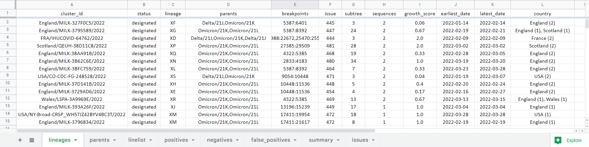
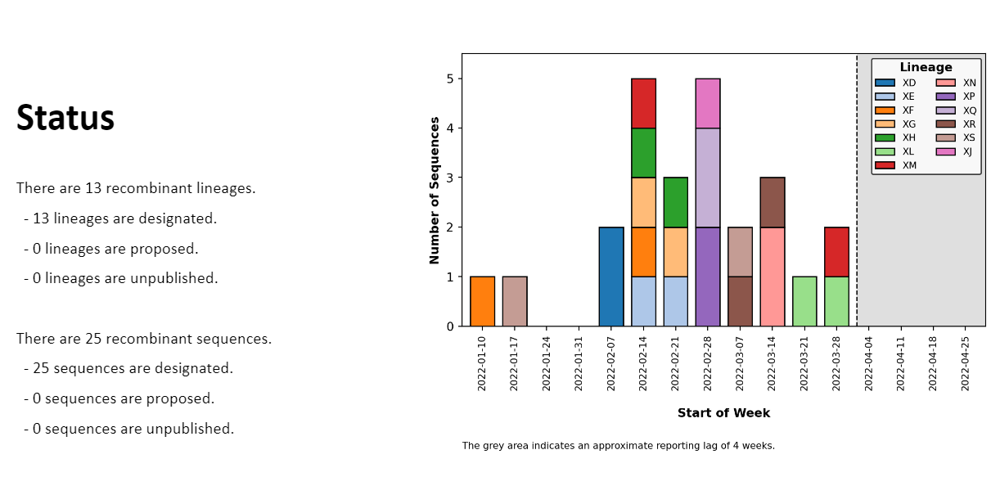
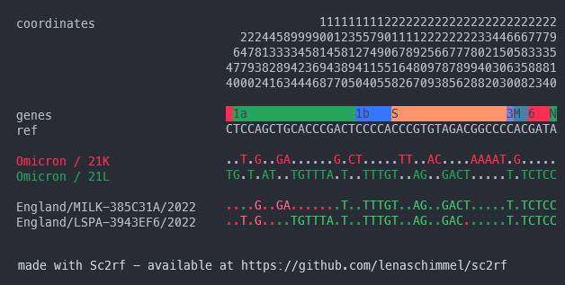
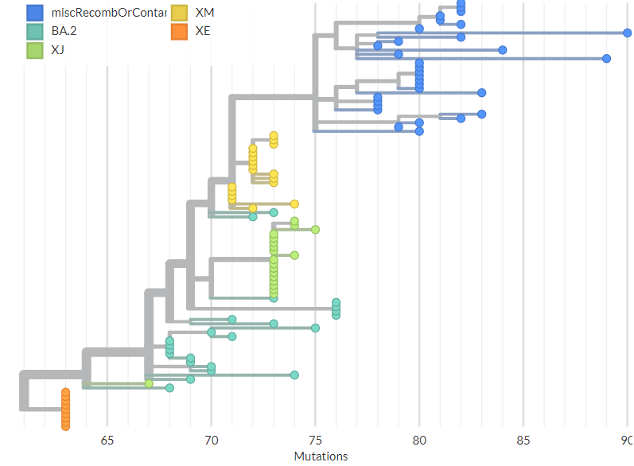
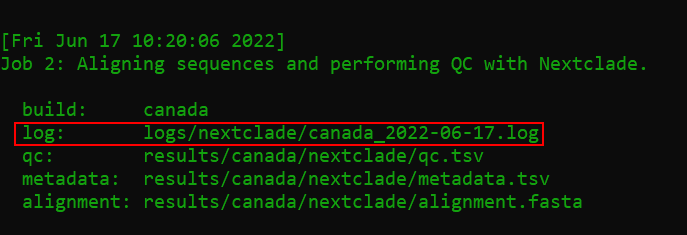

# ncov-recombinant
<!-- ALL-CONTRIBUTORS-BADGE:START - Do not remove or modify this section -->
[](#contributors-)
<!-- ALL-CONTRIBUTORS-BADGE:END -->

[](https://github.com/ktmeaton/ncov-recombinant/blob/master/LICENSE)
[](https://github.com/ktmeaton/ncov-recombinant/issues)
[](https://github.com/ktmeaton/ncov-recombinant/actions/workflows/install.yaml)
[](https://github.com/ktmeaton/ncov-recombinant/actions/workflows/test.yaml)
[](https://github.com/ktmeaton/ncov-recombinant/actions/workflows/pipeline.yaml)

SARS-CoV-2 recombinant sequence detection inspired by [nextstrain/ncov](https://github.com/nextstrain/ncov).

1. Align sequences and perform clade/lineage assignments with [Nextclade](https://github.com/nextstrain/nextclade).
1. Identify parental clades and plot recombination breakpoints with [sc2rf](https://github.com/lenaschimmel/sc2rf).
1. Phylogenetically place recombinant sequences with [UShER](https://github.com/yatisht/usher).
1. Create spreadssheets and powerpoint slides for reporting.

## Table of Contents

1. [Install](https://github.com/ktmeaton/ncov-recombinant#install)
1. [Update](https://github.com/ktmeaton/ncov-recombinant#update)
1. [Tutorial](https://github.com/ktmeaton/ncov-recombinant#tutorial)
1. [Output](https://github.com/ktmeaton/ncov-recombinant#output)
1. [Configuration](https://github.com/ktmeaton/ncov-recombinant#configuration)
1. [High Performance Computing](https://github.com/ktmeaton/ncov-recombinant#high-performance-computing)
1. [FAQ](https://github.com/ktmeaton/ncov-recombinant#faq)
1. [Credits](https://github.com/ktmeaton/ncov-recombinant#credits)

## Install

1. Clone the repository, using the `--recursive` flag for submodules:

    ```bash
    git clone --recursive https://github.com/ktmeaton/ncov-recombinant.git
    cd ncov-recombinant
    ```

2. Install dependencies in a conda environment (`ncov-recombinant`):

    ```bash
    mamba env create -f workflow/envs/environment.yaml
    conda activate ncov-recombinant
    ```

## Update

> **Tip**: If you have modified any pipeline files, it is often easier to instead do a [fresh install](https://github.com/ktmeaton/ncov-recombinant#install).

1. Save (`stash`) any modifications you may have made to pipeline files.

    ```bash
    git stash
    ```

1. Download and apply the latest updates.

    ```bash
    git pull origin master
    ```

1. (Optional) List available versions (`tags`).

    ```bash
    git tag
    ```

    ```text
    v0.1.0
    v0.1.1
    v0.1.2
    v0.2.0
    v0.2.1
    v0.3.0
    ```

1. (Optional) Snapshot the pipeline to a specific version (`tag`).

    ```bash
    git checkout v0.3.0
    ```

## Tutorial

> **Tip**: Remember to run `conda activate ncov-recombinant` first!

1. Preview the steps that are going to be run.

    ```bash
    snakemake --profile profiles/tutorial --dryrun
    ```

1. Run the workflow.

    ```bash
    snakemake --profile profiles/tutorial
    ```

1. Explore the [output](https://github.com/ktmeaton/ncov-recombinant#output).

    - Slides | `results/tutorial/report/report.pptx`
    - Tables<sup>*</sup> | `results/tutorial/report/report.xlsx`
    - Plots | `results/tutorial/plots`
    - Breakpoints<sup>†</sup> | `results/tutorial/sc2rf/recombinants.ansi.txt`
    - Trees<sup>‡</sup> | `results/tutorial/subtrees`

<sup>*</sup> Individual tables are available as TSV linelists in `results/tutorial/linelists`.  
<sup>†</sup> Visualize breakpoints with `less -S` or [Visual Studio ANSI Colors](https://marketplace.visualstudio.com/items?itemName=iliazeus.vscode-ansi).  
<sup>‡</sup>  Upload Auspice JSON trees to <https://auspice.us/>.

## Output

### Tables

Linelists are collated into a spreadsheet for excel/google sheets:

1. `lineage`: The recombinant lineages observed.
1. `parents`: The parental combinations observed.
1. `linelist`: Results from <u>all</u> input sequences (minimal statistics).
1. `summary`: Results from <u>all</u> input sequences (all possible statistics, for troubleshooting).
1. `positives`: Results from sequences classified as a <u>recombinant</u> by at least 2 of 3 classifiers.
1. `false_positives`: Results from sequences flagged as recombinants by Nextclade, that were not verified by [sc2rf](https://github.com/lenaschimmel/sc2rf) or [UShER](https://github.com/yatisht/usher).
1. `negatives`: Results from sequences classifed as a <u>non-recombinant</u> by nextclade.
1. `issues`: Metadata of issues related to recombinant lineages posted in the [pango-designation](https://github.com/cov-lineages/pango-designation/issues) repository.

[](
https://docs.google.com/spreadsheets/d/1FFkKO84LV74401Vc5Uero0gMc_-7npvp6x7M0x-nLJw/edit#gid=2069867983)

### Slides

Powerpoint/google slides with plots embedded for presenting.

[](https://docs.google.com/presentation/d/1eCPvaY1X3AzllTzmIwthY2i6GATsL3FDnW_LfE7CkQQ/edit#slide=id.p2)

### Breakpoints

Visualization of breakpoints by parent from [sc2rf](https://github.com/lenaschimmel/sc2rf).



### Phylogenetic Context

Placement of samples on the latest global phylogeny using [UShER](https://github.com/yatisht/usher).



## Controls

- After completing the tutorial, a good next step is to run the `controls` build.
- This build analyzes publicly available sequences in [`data/controls`](https://github.com/ktmeaton/ncov-recombinant/tree/master/data/controls), which include recombinant ("positive") and non-recombinant ("negative") sequences.
- With 1 CPU and 4 GB of memory, this takes ~30 minutes to complete.
- Instructions for how to include the `controls` in your custom build are in the [configuration](https://github.com/ktmeaton/ncov-recombinant#configuration) section.

1. Preview the steps that are going to be run.

    ```bash
    snakemake --profile profiles/controls --dryrun
    ```

1. Run the workflow.

    ```bash
    snakemake --profile profiles/controls
    ```

## Configuration

1. Create a new directory for your data.

    ```bash
    mkdir -p data/custom
    ```

1. Copy over your <u>unaligned</u> `sequences.fasta` and `metadata.tsv` to `data/custom`.

    > - **Note**: `metadata.tsv` MUST have at minimum the columns `strain`, `date`, `country`.  
    > - **Note**: The first column MUST be `strain`.

1. Create a profile for your custom build.

    ```bash
    scripts/create_profile.sh --data data/custom
    ```

    ```text
    2022-06-17 09:15:06     Searching for metadata (data/custom/metadata.tsv)
    2022-06-17 09:15:06     SUCCESS: metadata found
    2022-06-17 09:15:06     Checking for 3 required metadata columns (strain date country)
    2022-06-17 09:15:06     SUCCESS: 3 columns found.
    2022-06-17 09:15:06     Searching for sequences (data/custom/sequences.fasta)
    2022-06-17 09:15:06     SUCCESS: Sequences found
    2022-06-17 09:15:06     Checking that the metadata strains match the sequence names
    2022-06-17 09:15:06     SUCCESS: Strain column matches sequence names
    2022-06-17 09:15:06     Creating new profile directory (my_profiles/custom)
    2022-06-17 09:15:06     Creating build file (my_profiles/custom/builds.yaml)
    2022-06-17 09:15:06     Adding default input data (defaults/inputs.yaml)
    2022-06-17 09:15:06     Adding custom input data (data/custom)
    2022-06-17 09:15:06     Adding `custom` as a build
    2022-06-17 09:15:06     Creating system configuration (my_profiles/custom/config.yaml)
    2022-06-17 09:15:06     Adding default system resources
    2022-06-17 09:15:06     Done! The custom profile is ready to be run with:

                            snakemake --profile my_profiles/custom
    ```

    > - **Note**: you can add the param `--controls` to add a `controls` build that will run in parallel.
    > - **Note**: The `controls` build analyzes a dataset of positive and negative recombinant sequences, and adds \~30 min to the runtime.

1. Edit `my_profiles/custom/config.yaml`, so that the `jobs` and `default-resources` match your system.

    > **Note**: For HPC environments, see the [High Performance Computing](https://github.com/ktmeaton/ncov-recombinant#high-performance-computing) section.

    ```yaml
    #------------------------------------------------------------------------------#
    # System config
    #------------------------------------------------------------------------------#

    # Maximum number of jobs to run
    jobs : 2

    # Default resources for a SINGLE JOB
    default-resources:
    - cpus=2
    - mem_mb=8000
    - time_min=120
    ```

1. Do a dry run to confirm setup.

    ```bash
    snakemake --profile my_profiles/custom --dry-run
    ```

1. Run your custom profile.

    ```bash
    snakemake --profile my_profiles/custom
    ```

## High Performance Computing (HPC)

`ncov-recombinant` can alternatively be dispatched using the SLURM job submission system.

1. Create an HPC-compatible profile to store your build configuration.

    ```bash
    scripts/create_profile.sh --data data/custom --hpc
    ```

    ```text
    2022-06-17 09:16:55     Searching for metadata (data/custom/metadata.tsv)
    2022-06-17 09:16:55     SUCCESS: metadata found
    2022-06-17 09:16:55     Checking for 3 required metadata columns (strain date country)
    2022-06-17 09:16:55     SUCCESS: 3 columns found.
    2022-06-17 09:16:55     Searching for sequences (data/custom/sequences.fasta)
    2022-06-17 09:16:55     SUCCESS: Sequences found
    2022-06-17 09:16:55     Checking that the metadata strains match the sequence names
    2022-06-17 09:16:55     SUCCESS: Strain column matches sequence names
    2022-06-17 09:16:55     Creating new profile directory (my_profiles/custom-hpc)
    2022-06-17 09:16:55     Creating build file (my_profiles/custom-hpc/builds.yaml)
    2022-06-17 09:16:55     Adding default input data (defaults/inputs.yaml)
    2022-06-17 09:16:55     Adding custom input data (data/custom)
    2022-06-17 09:16:55     Adding `custom` as a build
    2022-06-17 09:16:55     Creating system configuration (my_profiles/custom-hpc/config.yaml)
    2022-06-17 09:16:55     Adding default HPC system resources
    2022-06-17 09:16:56     Done! The custom-hpc profile is ready to be run with:

                            snakemake --profile my_profiles/custom-hpc
    ```

2. Edit `my_profiles/custom-hpc/config.yaml` to specify the number of `jobs` and `default-resources` to use.

    ```yaml
    # Maximum number of jobs to run
    jobs : 4

    # Default resources for a SINGLE JOB
    default-resources:
    - cpus=64
    - mem_mb=64000
    - time_min=720
    ```

3. Dispatch the workflow using the slurm wrapper script:

    ```bash
    scripts/slurm.sh --profile my_profiles/custom-hpc
    ```

    > - **Tip**: Display log of most recent workflow: `cat $(ls -t logs/ncov-recombinant/*.log | head -n 1)`

4. Use the `--help` parameter to get additional options for SLURM dispatch.

    ```bash
    scripts/slurm.sh --help
    ```

    ```text
    usage: bash slurm.sh [-h] [--profile PROFILE] [--conda-env CONDA_ENV] [--target TARGET] [--cpus CPUS] [--mem MEM]

            Dispatch a Snakemake pipeline using SLURM.

            Required arguments:
                    --profile PROFILE                Snakemake profile to execute (ex. profiles/tutorial-hpc)

            Optional arguments:
                    --conda-env CONDA_ENV            Conda environment to use. (default: ncov-recombinant)
                    --target TARGET                  Snakemake target(s) to execute (default: all)
                    --cpus CPUS                      CPUS to use for the main pipeline. (default: 1)
                    --mem MEM                        Memory to use for the ain pipeline. (default: 4GB)
                    -h, --help                       Show this help message and exit.
    ```

## FAQ

1. What do I do if the workflow won't run because the directory is "locked"?

    ```bash
    snakemake --profile profiles/tutorial --unlock
    ```

1. How do I troubleshoot workflow errors?

    - Start with investigating the logfile of the rule that failed.

    

    - [Issue submissions](https://github.com/ktmeaton/ncov-recombinant/issues/33) are welcome and greatly appreciated!

1. How do I troubleshoot SLURM errors?

    - If the workflow was dispatched with `scripts/slurm.sh`, the master log will be stored at: `logs/ncov-recombinant/ncov-recombinant_<date>_<jobid>.log`

    > - **Tip**: Display log of most recent workflow: `cat $(ls -t logs/ncov-recombinant/*.log | head -n 1)`

1. Why is the `usher` rule taking a long time (+10 min)?

    - Placing samples on the global phylogeny is computationally intensive.
    - Option \#1 is to increase the resources in your profile's `config.yaml` file:

        ```yaml
        default-resources:
          - cpus=4
          - mem_mb=16000
          - time_min=720
        ```

    - Option \#2 is to reduce the sample size by excluding negatives n your profile's `builds.yaml` file:

        ```yaml
        builds:
          - name: custom
            base_input: public-latest

            sc2rf:
              exclude_negatives: true
        ```

    - Option \#3 for even aggressive sample filtering, is to exclude false positives as well:

        ```yaml
        builds:
          - name: custom
            base_input: public-latest

            sc2rf:
              exclude_negatives: true

            faToVcf:
              exclude_false_positives: true
        ```

1. How do I include more of my custom metadata columns into the linelists?

    - By default, the mandatory columns `strain`, `date`, and `country` will appear from your metadata.
    - Extra columns can be supplied as a parameter to `usher_metadata` in your `builds.yaml` file.
    - In the following example, the columns `division`, `gisaid_epi_isl`, and `ct` will be extracted from your input `metadata.tsv` file and included in the final linelists.

    ```yaml
      - name: custom
        base_input: public-latest

        usher_metadata:
          extra_cols:
            - division
            - gisaid_epi_isl
            - ct  
    ```

1. How do I cleanup all the output from a previous run?

    ```bash
    snakemake --profile profiles/tutorial --delete-all-output
    ```

1. Why are "positive" sequences missing from the plots and slides?

    - The most likely reason is that these sequences fall outside of the reporting period.
    - The default reporting period is set to 16 weeks before the present.
    - To change it for a build, add custom `plot` parameters to your `builds.yaml` file.

    ```yaml
      - name: custom
        base_input: public-latest

        plot:
            min_date: "2022-01-10"
            max_date: "2022-04-25" # Optional, can be left blank to use current date
    ```

1. Where can I find the plotting data?

    - A data table is provided for each plot:

        - Plot: `results/tutorial/plots/lineage.png`
        - Table: `results/tutorial/plots/lineage.tsv`
        - The rows are the epiweek, and the columns are the categories (ex. lineages)

## Credits

[ncov-recombinant](https://github.com/ktmeaton/ncov-recombinant) is built and maintained by [Katherine Eaton](https://ktmeaton.github.io/) at the [National Microbiology Laboratory (NML)](https://github.com/phac-nml) of the Public Health Agency of Canada (PHAC).

<table>
  <tr>
    <td align="center"><a href="https://ktmeaton.github.io"><br /><sub><b>Katherine Eaton</b></sub></a><br /><a href="https://github.com/ktmeaton/ncov-recombinant/commits?author=ktmeaton" title="Code">💻</a> <a href="https://github.com/ktmeaton/ncov-recombinant/commits?author=ktmeaton" title="Documentation">📖</a> <a href="#design-ktmeaton" title="Design">🎨</a> <a href="#ideas-ktmeaton" title="Ideas, Planning, & Feedback">🤔</a> <a href="#infra-ktmeaton" title="Infrastructure (Hosting, Build-Tools, etc)">🚇</a> <a href="#maintenance-ktmeaton" title="Maintenance">🚧</a></td>
  </tr>
</table>

Thanks goes to these wonderful people ([emoji key](https://allcontributors.org/docs/en/emoji-key)):

<!-- ALL-CONTRIBUTORS-LIST:START - Do not remove or modify this section -->
<!-- prettier-ignore-start -->
<!-- markdownlint-disable -->
<table>
  <tr>
    <td align="center"><a href="https://github.com/nextstrain/nextclade"><br /><sub><b>Nextstrain (Nextclade)</b></sub></a><br /><a href="#data-nextstrain" title="Data">🔣</a> <a href="#plugin-nextstrain" title="Plugin/utility libraries">🔌</a></td>
    <td align="center"><a href="https://github.com/lenaschimmel/sc2rf"><br /><sub><b>Lena Schimmel (sc2rf)</b></sub></a><br /><a href="#plugin-lenaschimmel" title="Plugin/utility libraries">🔌</a></td>
    <td align="center"><a href="https://github.com/yatisht/usher"><br /><sub><b>Yatish Turakhia (UShER)</b></sub></a><br /><a href="#data-yatisht" title="Data">🔣</a> <a href="#plugin-yatisht" title="Plugin/utility libraries">🔌</a></td>
    <td align="center"><a href="https://github.com/yatisht/usher"><br /><sub><b>Angie Hinrichs (UShER)</b></sub></a><br /><a href="#data-AngieHinrichs" title="Data">🔣</a> <a href="#plugin-AngieHinrichs" title="Plugin/utility libraries">🔌</a></td>
    <td align="center"><a href="https://www.inspq.qc.ca/en/auteurs/2629/all"><br /><sub><b>Benjamin Delisle</b></sub></a><br /><a href="https://github.com/ktmeaton/ncov-recombinant/issues?q=author%3Abenjamindeslisle" title="Bug reports">🐛</a> <a href="https://github.com/ktmeaton/ncov-recombinant/commits?author=benjamindeslisle" title="Tests">⚠️</a></td>
    <td align="center"><a href="https://ca.linkedin.com/in/dr-vani-priyadarsini-ikkurti-4a2ab676"><br /><sub><b>Vani Priyadarsini Ikkurthi</b></sub></a><br /><a href="https://github.com/ktmeaton/ncov-recombinant/issues?q=author%3Avanipriyadarsiniikkurthi" title="Bug reports">🐛</a> <a href="https://github.com/ktmeaton/ncov-recombinant/commits?author=vanipriyadarsiniikkurthi" title="Tests">⚠️</a></td>
  </tr>
</table>

<!-- markdownlint-restore -->
<!-- prettier-ignore-end -->

<!-- ALL-CONTRIBUTORS-LIST:END -->

This project follows the [all-contributors](https://github.com/all-contributors/all-contributors) specification. Contributions of any kind welcome!
