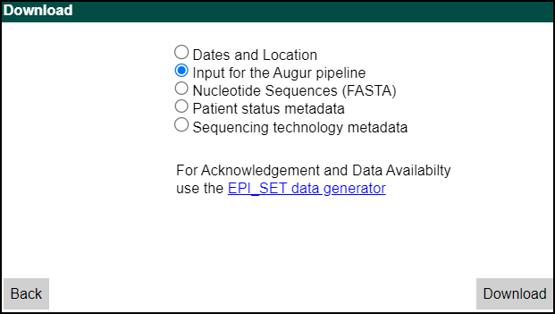

# ncov-recombinant
<!-- ALL-CONTRIBUTORS-BADGE:START - Do not remove or modify this section -->
[](#contributors-)
<!-- ALL-CONTRIBUTORS-BADGE:END -->

[](https://github.com/ktmeaton/ncov-recombinant/blob/master/LICENSE)
[](https://github.com/ktmeaton/ncov-recombinant/issues)
[](https://github.com/ktmeaton/ncov-recombinant/actions/workflows/install.yaml)
[](https://github.com/ktmeaton/ncov-recombinant/actions/workflows/pipeline.yaml)

SARS-CoV-2 recombinant sequence detection inspired by [nextstrain/ncov](https://github.com/nextstrain/ncov).

1. Align sequences and perform clade/lineage assignments with [Nextclade](https://github.com/nextstrain/nextclade).
1. Identify parental clades and plot recombination breakpoints with [sc2rf](https://github.com/lenaschimmel/sc2rf).
1. Create tables, plots, and powerpoint slides for reporting.

## Table of Contents

1. [What is a Recombinant?](https://github.com/ktmeaton/ncov-recombinant#what-is-a-recombinant)
1. [Install](https://github.com/ktmeaton/ncov-recombinant#install)
1. [Update](https://github.com/ktmeaton/ncov-recombinant#update)
1. [Tutorial](https://github.com/ktmeaton/ncov-recombinant#tutorial)
1. [Output](https://github.com/ktmeaton/ncov-recombinant#output)
1. [Configuration](https://github.com/ktmeaton/ncov-recombinant#configuration)
1. [High Performance Computing](https://github.com/ktmeaton/ncov-recombinant#high-performance-computing)
1. [FAQ](https://github.com/ktmeaton/ncov-recombinant#faq)
1. [Credits](https://github.com/ktmeaton/ncov-recombinant#credits)

## What is a Recombinant?

A recombinant lineage is defined as a group of sequences with a unique combination of:

- Lineage assignment (ex. `XM`)
- Parental clades (ex. `Omicron/21K`,`Omicron/21L`)
- Parental lineages (ex. `BA.1.1`,`BA.2.12.1`)
- Breakpoint intervals (ex. `17411:21617`)

### Designated Recombinants

Designated recombinants from [pango-designation](https://github.com/cov-lineages/pango-designation) can be identified by a lineage assignment that starts with `X` (ex. `XA`).

### Novel Recombinants

Novel recombinants (i.e. undesignated) can be identified by a lineage assignment that _does not_ start with `X*` (ex. BA.1.1) _or_ with a lineage assignment that contains `-like` (ex. `XM-like`).

## Install

1. Clone the repository:

    ```bash
    git clone https://github.com/ktmeaton/ncov-recombinant.git
    cd ncov-recombinant
    ```

2. Install dependencies in a conda environment (`ncov-recombinant`):

    ```bash
    mamba env create -f workflow/envs/environment.yaml
    conda activate ncov-recombinant
    ```

## Update

> **Tip**: It is recommended to do a [fresh install](https://github.com/ktmeaton/ncov-recombinant#install) in a separate directory to test a newer version.

After pulling a fresh copy of the git repository, don't forget to update your conda environment!

```bash
mamba env update -f workflow/envs/environment.yaml
```

After running the newly installed version, you can compare lineage assignment changes using the following script:

```bash
python3 scripts/compare_positives.py \
  --positives-1 old_pipeline_ver/results/controls/linelists/positives.tsv \
  --positives-2 new_pipeline_ver/results/controls/linelists/positives.tsv \
  --ver-1 "old_ver" \
  --ver-2 "new_ver" \
  --outdir compare/controls \
  --node-order alphabetical
```

A comparative report is provided for each major release:

- `v0.5.1` → `v0.6.0` : [docs/testing_summary_package/ncov-recombinant_v0.5.1_v0.6.0.html](https://ktmeaton.github.io/ncov-recombinant/docs/testing_summary_package/ncov-recombinant_v0.5.1_v0.6.0.html)
- `v0.4.2` → `v0.5.0` : [docs/testing_summary_package/ncov-recombinant_v0.4.2_v0.5.0.html](https://ktmeaton.github.io/ncov-recombinant/docs/testing_summary_package/ncov-recombinant_v0.4.2_v0.5.0.html)

## Tutorial

> **Tip**: Remember to run `conda activate ncov-recombinant` first!

1. Preview the steps that are going to be run.

    ```bash
    snakemake --profile profiles/tutorial --dryrun
    ```

1. Run the workflow.

    ```bash
    snakemake --profile profiles/tutorial
    ```

1. Explore the [output](https://github.com/ktmeaton/ncov-recombinant#output).

    - Slides | `results/tutorial/report/report.pptx`
    - Tables<sup>*</sup> | `results/tutorial/report/report.xlsx`
    - Plots
        - Reporting Period (default: last 16 weeks): `results/tutorial/plots`
        - All sequences: `results/tutorial/plots_historical`
    - Breakpoints
        - By parental clade: `results/tutorial/plots_historical/breakpoints_clade.png`
        - By parental lineage: `results/tutorial/plots_historical/breakpoints_lineage.png`
    - Alleles <sup>†</sup> | `results/tutorial/sc2rf/recombinants.ansi.txt`

<sup>*</sup> Individual tables are available as TSV linelists in `results/tutorial/linelists`.  
<sup>†</sup> Visualize sc2rf mutations with `less -S` or [Visual Studio ANSI Colors](https://marketplace.visualstudio.com/items?itemName=iliazeus.vscode-ansi).  

## Output

### Tables

Linelists are collated into a spreadsheet for excel/google sheets:

1. `lineage`: The recombinant lineages observed.
1. `parents`: The parental combinations observed.
1. `linelist`: Results from <u>all</u> input sequences (minimal statistics).
1. `summary`: Results from <u>all</u> input sequences (all possible statistics, for troubleshooting).
1. `positives`: Results from sequences classified as a <u>recombinant</u>, as verified by breakpoint detection with [sc2rf](https://github.com/lenaschimmel/sc2rf).
1. `false_positives`: Results from sequences flagged as recombinants by Nextclade, that were not verified by [sc2rf](https://github.com/lenaschimmel/sc2rf).
1. `negatives`: Results from sequences classifed as a <u>non-recombinant</u> by nextclade.
1. `issues`: Metadata of issues related to recombinant lineages posted in the [pango-designation](https://github.com/cov-lineages/pango-designation/issues) repository.

[](
https://docs.google.com/spreadsheets/d/1kVqQScrJneeJ4t7RmSeJTeWVGHecir1CEgq6hl8qirI)

### Slides

Powerpoint/google slides with plots embedded for presenting.

[](https://docs.google.com/presentation/d/1Jo4BYBa2K8kvRnKxo9ZpnqhS86ZLh3D1HTF3E8hfD0Q)

### Breakpoints

Visualization of breakpoints by parental clade and parental lineage.

|                                         Clade                                          |                                         Lineage                                          |
|:--------------------------------------------------------------------------------------:|:----------------------------------------------------------------------------------------:|
|  |  |

Visualization of parental alleles and mutations from [sc2rf](https://github.com/lenaschimmel/sc2rf).


## Controls

### Genbank

- After completing the tutorial, a good next step is to run the `controls` build.
- This build analyzes publicly available sequences in [`data/controls`](https://github.com/ktmeaton/ncov-recombinant/tree/master/data/controls), which include recombinant ("positive") and non-recombinant ("negative") sequences.
- Instructions for how to include the `controls` in your custom build are in the [configuration](https://github.com/ktmeaton/ncov-recombinant#configuration) section.

1. Run the workflow.

    ```bash
    snakemake --profile profiles/controls
    ```

### GISAID

- For GISAID users, a [comprehensive strain list](https://github.com/ktmeaton/ncov-recombinant/blob/dev/data/controls-gisaid/strains.txt) is provided that includes all designated recombinants to date (`XA` - `XBE`). This dataset includes 600+ sequences, and can be used for in-depth validation and testing.
- It is recommended to use the "Input for the Augur pipeline" option, to download a `tar` compressed archive of metadata and sequences to `data/controls-gisaid/`.
    [](https://www.epicov.org/)

1. Prep the input metadata and sequences.

    ```bash
    cd data/controls-gisaid
    tar -xvf gisaid_auspice_input_hcov-19_*.tar
    mv *sequences.fasta sequences.fasta
    # Retain minimal metadata columns, to avoid non-ascii characters
     csvtk cut -t -l -f 'strain,date,country,gisaid_epi_isl,pangolin_lineage' *.metadata.tsv > metadata.tsv
    cd ../..
    ```

1. Run the workflow.

    ```bash
    # Option 1: Local testing
    snakemake --profile profiles/controls-gisaid

    # Option 2: High Performance Computing with SLURM
    scripts/slurm.sh --profile profiles/controls-gisaid
    ```

## Configuration

1. Create a new directory for your data.

    ```bash
    mkdir -p data/custom
    ```

1. Copy over your <u>unaligned</u> `sequences.fasta` and `metadata.tsv` to `data/custom`.

    > - **Note**: GISAID sequences and metadata can be downloaded using the "Input for the Augur pipeline" option on <https://gisaid.org/>.
    > - `metadata.tsv` MUST have at minimum the columns `strain`, `date`, `country`.  
    > If collection dates or country are unknown, these fields can be left empty or filled with "NA".
    > - The first column MUST be `strain`.

1. Create a profile for your custom build.

    ```bash
    scripts/create_profile.sh --data data/custom
    ```

    ```text
    2022-06-17 09:15:06     Searching for metadata (data/custom/metadata.tsv)
    2022-06-17 09:15:06     SUCCESS: metadata found
    2022-06-17 09:15:06     Checking for 3 required metadata columns (strain date country)
    2022-06-17 09:15:06     SUCCESS: 3 columns found.
    2022-06-17 09:15:06     Searching for sequences (data/custom/sequences.fasta)
    2022-06-17 09:15:06     SUCCESS: Sequences found
    2022-06-17 09:15:06     Checking that the metadata strains match the sequence names
    2022-06-17 09:15:06     SUCCESS: Strain column matches sequence names
    2022-06-17 09:15:06     Creating new profile directory (my_profiles/custom)
    2022-06-17 09:15:06     Creating build file (my_profiles/custom/builds.yaml)
    2022-06-17 09:15:06     Adding default input data (defaults/inputs.yaml)
    2022-06-17 09:15:06     Adding custom input data (data/custom)
    2022-06-17 09:15:06     Adding `custom` as a build
    2022-06-17 09:15:06     Creating system configuration (my_profiles/custom/config.yaml)
    2022-06-17 09:15:06     Adding default system resources
    2022-06-17 09:15:06     Done! The custom profile is ready to be run with:

                            snakemake --profile my_profiles/custom
    ```

    > - **Note**: you can add the param `--controls` to add the `controls` build that will run in parallel.

1. Edit `my_profiles/custom/config.yaml`, so that the `jobs` and `default-resources` match your system.

    > **Note**: For HPC environments, see the [High Performance Computing](https://github.com/ktmeaton/ncov-recombinant#high-performance-computing) section.

    ```yaml
    #------------------------------------------------------------------------------#
    # System config
    #------------------------------------------------------------------------------#

    # Maximum number of jobs to run simultaneously
    jobs : 1

    # Default resources for a SINGLE JOB
    default-resources:
    - cpus=1
    - mem_mb=4000
    - time_min=60
    ```

1. Do a "dry run" to confirm setup.

    ```bash
    snakemake --profile my_profiles/custom --dry-run
    ```

1. Run your custom profile.

    ```bash
    snakemake --profile my_profiles/custom
    ```

## High Performance Computing

`ncov-recombinant` can alternatively be dispatched using the SLURM job submission system.

1. Create an HPC-compatible profile to store your build configuration.

    ```bash
    scripts/create_profile.sh --data data/custom --hpc
    ```

    ```text
    2022-06-17 09:16:55     Searching for metadata (data/custom/metadata.tsv)
    2022-06-17 09:16:55     SUCCESS: metadata found
    2022-06-17 09:16:55     Checking for 3 required metadata columns (strain date country)
    2022-06-17 09:16:55     SUCCESS: 3 columns found.
    2022-06-17 09:16:55     Searching for sequences (data/custom/sequences.fasta)
    2022-06-17 09:16:55     SUCCESS: Sequences found
    2022-06-17 09:16:55     Checking that the metadata strains match the sequence names
    2022-06-17 09:16:55     SUCCESS: Strain column matches sequence names
    2022-06-17 09:16:55     Creating new profile directory (my_profiles/custom-hpc)
    2022-06-17 09:16:55     Creating build file (my_profiles/custom-hpc/builds.yaml)
    2022-06-17 09:16:55     Adding default input data (defaults/inputs.yaml)
    2022-06-17 09:16:55     Adding custom input data (data/custom)
    2022-06-17 09:16:55     Adding `custom` as a build
    2022-06-17 09:16:55     Creating system configuration (my_profiles/custom-hpc/config.yaml)
    2022-06-17 09:16:55     Adding default HPC system resources
    2022-06-17 09:16:55     System resources can be further configured in:

                            my_profiles/custom-hpc/config.yaml

    2022-06-17 09:16:55     Builds can be configured in:

                            my_profiles/custom-hpc/builds.yaml

    2022-06-17 09:16:55     The custom-hpc profile is ready to be run with:

                            scripts/slurm.sh --profile my_profiles/custom-hpc  
    ```

2. Edit `my_profiles/custom-hpc/config.yaml` to specify the number of `jobs` and `default-resources` to use.

    ```yaml
    # Maximum number of jobs to run simultaneously
    jobs : 4

    # Default resources for a SINGLE JOB
    default-resources:
    - cpus=64
    - mem_mb=64000
    - time_min=720
    ```

3. Dispatch the workflow using the slurm wrapper script:

    ```bash
    scripts/slurm.sh --profile my_profiles/custom-hpc
    ```

    > - **Tip**: Display log of most recent workflow: `cat $(ls -t logs/ncov-recombinant/*.log | head -n 1)`

4. Use the `--help` parameter to get additional options for SLURM dispatch.

    ```bash
    scripts/slurm.sh --help
    ```

    ```text
    usage: bash slurm.sh [-h] [--profile PROFILE] [--conda-env CONDA_ENV] [--target TARGET] [--cpus CPUS] [--mem MEM]

            Dispatch a Snakemake pipeline using SLURM.

            Required arguments:
                    --profile PROFILE                Snakemake profile to execute (ex. profiles/tutorial-hpc)

            Optional arguments:
                    --conda-env CONDA_ENV            Conda environment to use. (default: ncov-recombinant)
                    --target TARGET                  Snakemake target(s) to execute (default: all)
                    --cpus CPUS                      CPUS to use for the main pipeline. (default: 1)
                    --mem MEM                        Memory to use for the ain pipeline. (default: 4GB)
                    -h, --help                       Show this help message and exit.
    ```

## Credits

[ncov-recombinant](https://github.com/ktmeaton/ncov-recombinant) is built and maintained by [Katherine Eaton](https://ktmeaton.github.io/) at the [National Microbiology Laboratory (NML)](https://github.com/phac-nml) of the Public Health Agency of Canada (PHAC).

<table>
  <tr>
    <td align="center"><a href="https://ktmeaton.github.io"><br /><sub><b>Katherine Eaton</b></sub></a><br /><a href="https://github.com/ktmeaton/ncov-recombinant/commits?author=ktmeaton" title="Code">💻</a> <a href="https://github.com/ktmeaton/ncov-recombinant/commits?author=ktmeaton" title="Documentation">📖</a> <a href="#design-ktmeaton" title="Design">🎨</a> <a href="#ideas-ktmeaton" title="Ideas, Planning, & Feedback">🤔</a> <a href="#infra-ktmeaton" title="Infrastructure (Hosting, Build-Tools, etc)">🚇</a> <a href="#maintenance-ktmeaton" title="Maintenance">🚧</a></td>
  </tr>
</table>

Thanks goes to these wonderful people ([emoji key](https://allcontributors.org/docs/en/emoji-key)):

<!-- ALL-CONTRIBUTORS-LIST:START - Do not remove or modify this section -->
<!-- prettier-ignore-start -->
<!-- markdownlint-disable -->
<table>
  <tr>
    <td align="center"><a href="https://github.com/nextstrain/nextclade"><br /><sub><b>Nextstrain (Nextclade)</b></sub></a><br /><a href="#data-nextstrain" title="Data">🔣</a> <a href="#plugin-nextstrain" title="Plugin/utility libraries">🔌</a></td>
    <td align="center"><a href="https://github.com/lenaschimmel/sc2rf"><br /><sub><b>Lena Schimmel (sc2rf)</b></sub></a><br /><a href="#plugin-lenaschimmel" title="Plugin/utility libraries">🔌</a></td>
    <td align="center"><a href="https://github.com/yatisht/usher"><br /><sub><b>Yatish Turakhia (UShER)</b></sub></a><br /><a href="#data-yatisht" title="Data">🔣</a> <a href="#plugin-yatisht" title="Plugin/utility libraries">🔌</a></td>
    <td align="center"><a href="https://github.com/yatisht/usher"><br /><sub><b>Angie Hinrichs (UShER)</b></sub></a><br /><a href="#data-AngieHinrichs" title="Data">🔣</a> <a href="#plugin-AngieHinrichs" title="Plugin/utility libraries">🔌</a></td>
    <td align="center"><a href="https://www.inspq.qc.ca/en/auteurs/2629/all"><br /><sub><b>Benjamin Delisle</b></sub></a><br /><a href="https://github.com/ktmeaton/ncov-recombinant/issues?q=author%3Abenjamindeslisle" title="Bug reports">🐛</a> <a href="https://github.com/ktmeaton/ncov-recombinant/commits?author=benjamindeslisle" title="Tests">⚠️</a></td>
  </tr>
  <tr>
    <td align="center"><a href="https://ca.linkedin.com/in/dr-vani-priyadarsini-ikkurti-4a2ab676"><br /><sub><b>Vani Priyadarsini Ikkurthi</b></sub></a><br /><a href="https://github.com/ktmeaton/ncov-recombinant/issues?q=author%3Avanipriyadarsiniikkurthi" title="Bug reports">🐛</a> <a href="https://github.com/ktmeaton/ncov-recombinant/commits?author=vanipriyadarsiniikkurthi" title="Tests">⚠️</a></td>
    <td align="center"><a href="https://ca.linkedin.com/in/mark-horsman-52a14740"><br /><sub><b>Mark Horsman</b></sub></a><br /><a href="#ideas-markhorsman" title="Ideas, Planning, & Feedback">🤔</a> <a href="#design-markhorsman" title="Design">🎨</a></td>
    <td align="center"><a href="https://github.com/jbloomlab"><br /><sub><b>Jesse Bloom Lab</b></sub></a><br /><a href="#data-jbloomlab" title="Data">🔣</a> <a href="#plugin-jbloomlab" title="Plugin/utility libraries">🔌</a></td>
    <td align="center"><a href="https://github.com/dfornika"><br /><sub><b>Dan Fornika</b></sub></a><br /><a href="#ideas-dfornika" title="Ideas, Planning, & Feedback">🤔</a> <a href="https://github.com/ktmeaton/ncov-recombinant/commits?author=dfornika" title="Tests">⚠️</a></td>
    <td align="center"><br /><sub><b>Tara Newman</b></sub><br /><a href="#ideas-TaraNewman" title="Ideas, Planning, & Feedback">🤔</a> <a href="https://github.com/ktmeaton/ncov-recombinant/commits?author=TaraNewman" title="Tests">⚠️</a></td>
  </tr>
</table>

<!-- markdownlint-restore -->
<!-- prettier-ignore-end -->

<!-- ALL-CONTRIBUTORS-LIST:END -->

This project follows the [all-contributors](https://github.com/all-contributors/all-contributors) specification. Contributions of any kind welcome!

## FAQ

1. What do I do if the workflow won't run because the directory is "locked"?

    ```bash
    snakemake --profile profiles/tutorial --unlock
    ```

1. How do I troubleshoot workflow errors?

    - Start with investigating the logfile of the rule that failed.

    

    - [Issue submissions](https://github.com/ktmeaton/ncov-recombinant/issues/33) are welcome and greatly appreciated!

1. How do I troubleshoot SLURM errors?

    - If the workflow was dispatched with `scripts/slurm.sh`, the master log will be stored at: `logs/ncov-recombinant/ncov-recombinant_<date>_<jobid>.log`

    > - **Tip**: Display log of most recent workflow: `cat $(ls -t logs/ncov-recombinant/*.log | head -n 1)`

1. Why is the pipeline exiting with `ConnectionError` or `HTTPSError`?

    Network connection issues can occur in the rule `sc2rf_recombinants`, where the [LAPIS API](https://lapis-docs.readthedocs.io/en/latest/) is used to query [covSPECTRUM](https://cov-spectrum.org/explore/World) in order to identify the most likely parental lineages. For troubleshooting and solutions, please see [Issue #202](https://github.com/ktmeaton/ncov-recombinant/issues/202) and [Issue #201](https://github.com/ktmeaton/ncov-recombinant/issues/201).

1. How do I cleanup all the output from a previous run?

    ```bash
    snakemake --profile profiles/tutorial --delete-all-output
    ```

1. Why are some lineages called `X*-like`?

    A cluster of sequences may be flagged as `-like` if one of following criteria apply:

    1. The lineage assignment by [Nextclade](https://github.com/nextstrain/nextclade) conflicts with the published breakpoints for a designated lineage (`resources/breakpoints.tsv`).

        - Ex. An `XE` assigned sample has breakpoint `11538:12879` which conflicts with the published `XE` breakpoint (`ex. 8394:12879`). This will be renamed `XE-like`.

    1. The cluster has 10 or more sequences, which share at least 3 private mutations in common.

        - Ex. A large cluster of sequences (N=50) are assigned `XM`. However, these 50 samples share 5 private mutations `T2470C,C4586T,C9857T,C12085T,C26577G` which do not appear in true `XM` sequences. This will be renamed `XM-like`. Upon further review of the reported matching [pango-designation issues](https://github.com/cov-lineages/pango-designation/issues) (`460,757,781,472,798`), we find this cluster to be a match to `proposed798`.

1. Why are some lineages classified as "positive" recombinants but have no information about their parents or breakpoints?

    There are 5 recombinant lineages that _can_ be identified by `nextclade` but _cannot_ be verified by `sc2rf`. When sequences of these lineages are detected by `nextclade`, they will be automatically passed ("autopass") through `sc2rf` as positives. As a result, these sequences will have `NA` values under columns such as `parents_clade` and `breakpoints`.

    1. `XN` | [Issue #137](https://github.com/ktmeaton/ncov-recombinant/issues/137) | Breakpoints lie at the extreme 5' end of the genome.
    1. `XP` | [Issue #136](https://github.com/ktmeaton/ncov-recombinant/issues/137) | Breakpoints lie at the extreme 3' end of the genome.
    1. `XAR` | [Issue #106](https://github.com/ktmeaton/ncov-recombinant/issues/106) | Breakpoints lie at the extreme 5' end of the genome.
    1. `XAS` | [Issue #86](https://github.com/ktmeaton/ncov-recombinant/issues/86) | The first parent cannot be differentiated between `BA.5` and `BA.4` (without using deletions).
    1. `XAZ` | [Issue #87](https://github.com/ktmeaton/ncov-recombinant/issues/87) | There are no "diagnostic" mutations from the second parent (`BA.2`).

    The setting for auto-passing certain lineages is located in `defaults/parameters.yaml` under the section `sc2rf_recombinants` and `auto_pass`.

1. How are the immune-related statistics calculated (ex. `rbd_level`, `immune_escape`, `ace2_binding`)?

    These are obtained from `nextclade`, the `Nextstrain` team, and Jesse Bloom's group:

    - https://github.com/nextstrain/ncov/blob/master/defaults/rbd_levels.yaml
    - https://jbloomlab.github.io/SARS-CoV-2-RBD_DMS_Omicron/epistatic-shifts/
    - https://jbloomlab.github.io/SARS2_RBD_Ab_escape_maps/escape-calc/
    - https://doi.org/10.1093/ve/veac021
    - https://doi.org/10.1101/2022.09.15.507787
    - https://doi.org/10.1101/2022.09.20.508745

1. How do I change the parameters for a rule?

    - Find the rule you are interested in customizing in `defaults/parameters.yaml`. For example, maybe you want recombinants visualized by `division` rather than `country`.

        ```yaml
        # ---------------------------------------------------------------------------
        # geo : Column to use for a geographic summary (typically region, country, or division)
        - name: linelist
          geo: country
        ```

    - Then copy over the defaults into your custom profile (`my_profiles/custom/builds.yaml`), and adjust the yaml formatting. Note that `- name: linelist` has become `linelist:` which is idented to be flush with the `sequences:` parameter.

        ```yaml
        - name: custom
          metadata: data/custom/metadata.tsv
          sequences: data/custom/sequences.fasta

          linelist:
            geo: division
        ```

1. How do I include more of my custom metadata columns into the linelists?

    - By default, the mandatory columns `strain`, `date`, and `country` will appear from your metadata.
    - Extra columns can be supplied as a parameter to `summary` in your `builds.yaml` file.
    - In the following example, the columns `division`, and `genbank_accession` will be extracted from your input `metadata.tsv` file and included in the final linelists.

    ```yaml
    - name: controls
      metadata: data/controls/metadata.tsv
      sequences: data/controls/sequences.fasta

      summary:
        extra_cols:
          - genbank_accession
          - division
    ```

1. Where can I find the plotting data?

    - A data table is provided for each plot:

        - Plot: `results/tutorial/plots/lineage.png`
        - Table: `results/tutorial/plots/lineage.tsv`
        - The rows are the epiweek, and the columns are the categories (ex. lineages)

1. Why are "positive" sequences missing from the plots and slides?

    - First check and see if they are in `plots_historical` and `report_historical` which summarize all sequences regardless of collection date.
    - The most likely reason is that these sequences fall outside of the reporting period.
    - The default reporting period is set to 16 weeks before the present.
    - To change it for a build, add custom `plot` parameters to your `builds.yaml` file.

    ```yaml
    - name: custom
      metadata: data/custom/metadata.tsv
      sequences: data/custom/sequences.fasta

      plot:
        min_date: "2022-01-10"
        max_date: "2022-04-25" # Optional, can be left blank to use current date
    ```

## Development

There are three main triggers to initate new development:

1. A new lineage dataset has been released: https://github.com/nextstrain/nextclade_data/releases
1. A new nextclade-cli has been released: https://github.com/nextstrain/nextclade/releases
1. A new recombinant lineage has been proposed: https://github.com/cov-lineages/pango-designation/issues?q=recombinant
1. A new recombinant lineage has been designated: https://github.com/cov-lineages/pango-designation/milestones. New designations _should_ be labelled as milestones.

Beging by creating a personal dev conda environment.

```bash
mamba env create -f workflow/envs/environment.yaml -n ncov-recombinant-dev
```

After completing a development trigger, proceed with the **Validation** section.

### Trigger 1 | New Lineage Dataset

1. Obtain the new dataset tag from: https://github.com/nextstrain/nextclade_data/releases.

1. Update all 3 dataset tags in `defaults/parameters.yaml`.

    For example, change all strings of `"2022-10-27T12:00:00Z"` to the new dataset tag for November such as `"2022-11-27T12:00:00Z"`.

    ```yaml
    - name: nextclade_dataset
      dataset: sars-cov-2
      tag: "2022-10-27T12:00:00Z"
      dataset_no-recomb: sars-cov-2-no-recomb
      tag_no-recomb: "2022-10-27T12:00:00Z"
      dataset_immune-escape: sars-cov-2-21L
      tag_immune-escape: "2022-10-27T12:00:00Z"
    ```

### Trigger 2 | New Nextclade CLI

1. Check that the new nextclade-cli has been made available on conda: https://anaconda.org
1. Update the following line in `workflow/envs/environment.yaml` to the newest version:

    ```yaml
    - bioconda::nextclade=2.8.0
    ```

1. Update the personal dev conda environment.

    ```bash
    mamba env update -f workflow/envs/environment.yaml -n ncov-recombinant-dev
    ```

### Trigger 3 | New Proposed Lineage

1. Create a new data directory.

    ```bash
    mkdir -p data/proposedXXX
    ```

1. Check the correponsing [pango-designation issue](https://github.com/cov-lineages/pango-designation/issues?q=recombinant) for a list of GISAID accessions.

1. Download 10-20 of these GISAID accessions from <https://gisaid.org/>. Please review the [GISAID Download](https://github.com/ktmeaton/ncov-recombinant#gisaid) section of the README to ensure the sequences and metadata are correctly formatted.

1. Create a new pipeline profile for this lineage.

    ```bash
    scripts/create_profile.sh --data data/proposedXXX
    ```

1. Run the pipeline up to `sc2rf` breakpoint detection.

    ```bash
    snakemake --profile my_profiles/proposedXXX results/proposedXXX/sc2rf/stats.tsv
    ```

    When finished, check the stats file and confirm whether `sc2rf_status` is `positive`, `sc2rf_parents` match the pango-designation issue information. If so, skip to the validation section.

    ```bash
    csvtk pretty -t results/proposedXXX/sc2rf/stats.tsv | less -S

    # Or
    csvtk cut -t -f "strain,sc2rf_status,sc2rf_parents,sc2rf_breakpoints" results/XBB/sc2rf/stats.tsv
    ```

1. Update/create `sc2rf` modes.  

    If `sc2rf_status` is not `positive`, command-line parameters for `sc2rf` will need to be tweaked. To begin with, run `sc2rf` manually with the following debugging parameters. And changing `--clades BA.2 BA.5.2` to a space separated list of potential parents.

    ```bash
    python3 sc2rf/sc2rf.py results/proposedXXX/nextclade/alignment.fasta \
      --ansi \
      --max-ambiguous 20 \
      --max-intermission-length 2 \
      --ignore-shared \
      --mutation-threshold 0.25 \
      --max-intermission-count 20 \
      --parents 0-10 \
      --breakpoints 0-10 \
      --unique 0 \
      --clades BA.2 BA.5.2
    ```

    If the potential parents don't appear in the output, they will need to be added to `sc2rf/mapping.csv` and the allele frequency database updated with:

    ```bash
    cd sc2rf/
    python3 sc2rf.py --rebuild-examples
    cd ..
    ```

    Then rerun the previous command and verify that the parents appear in the output. The next step is to increase the stringency of `--parents`, `--breakpoints`, `--unique`, and `--max-intermission-count` as much as possible.

    Once a parameter set is found, review the existing `sc2rf` modes in `defaults/parameters.yaml`. It is ideal to have as few modes as possible, so the first check is to see whether the new parameter set can be integrated into an existing mode. Failing that, a new mode should be created in the list to capture this recombinant.

    ```yaml
    - name: sc2rf
      mode:
      # Lineage specific validation)
        - XA:              "--clades 20I 20E 20F 20D             --ansi --parents 2   --breakpoints 1-3  --unique 2 --max-ambiguous 20 --max-intermission-length 2 --max-intermission-count 3  --ignore-shared --mutation-threshold 0.25"
        ...
        # Current Variants of Concern and Dominant Lineages
        - voc:             "--clades BA.2.10 BA.2.3.17 BA.2.3.20 BA.2.75 BA.4.6 BA.5.2 BA.5.3 XBB --ansi --parents 2-4 --breakpoints 1-5 --unique 1 --max-ambiguous 20 --max-intermission-length 2 --max-intermission-count 3  --ignore-shared --mutation-threshold 0.25"
    ```

1. Repeat steps 5 and 6, until the recombinant is successully identified by `sc2rf`.

### Trigger 4 | New Designated Lineage

1. Complete all steps for Trigger 3 | New Proposed Lineage, except:

    - Include no more than 10 representative sequences.
    - Make the data directory `data/X*` instead of `data/proposed*`.

1. Add the new designated lineage to the `gisaid-positive` dataset.

    This step expects all positive controls to be stored in individual directories starting with `data/X*`. Their metadata and sequences will be collated into `data/gisaid-positive`.

    ```bash
    # Remove authors and originating lab for non-ascii char
    cols=$(csvtk headers -t data/XA/metadata.tsv | grep -v -E "originating_lab|authors" | tr "\n" "," | sed 's/,$/\n/g')

    # Construct the metadata header
    csvtk cut -t -f "$cols" data/XA/metadata.tsv | head -n 1 > data/gisaid-positive/metadata.tsv

    # Extract metadata cols and concat for all X* lineages.
    for data_dir in $(ls -d data/X*); do
        csvtk cut -t -f "$cols" ${data_dir}/metadata.tsv | tail -n+2 >> data/gisaid-positive/metadata.tsv
    done

    # Combine all X* lineage sequences
    cat data/X*/sequences.fasta > data/gisaid-positive/sequences.fasta
    ```

1. Combine the `gisaid-positive` and `gisaid-negative` datasets into the `controls-gisaid` dataset.

    ```bash
    csvtk concat -t data/gisaid-positive/metadata.tsv data/gisaid-negative/metadata.tsv > data/controls-gisaid/metadata.tsv

    cat data/gisaid-positive/sequences.fasta data/gisaid-negative/sequences.fasta > data/controls-gisaid/sequences.fasta

    csvtk cut -t -f "strain" data/controls-gisaid/metadata.tsv | tail -n+2 > data/controls-gisaid/strains.txt
    ```

1. Update the controls validation values.

    The file `defaults/validation.tsv` contains the expected values for all controlled datasets including: `tutorial`, `controls`, and `controls-gisaid`.

    ```bash
    # Construct headers
    echo -e "strain\tlineage\tbreakpoints\tparents_clade\tdataset" > defaults/validation.tsv

    # Tutorial
    csvtk cut -t -f "strain,lineage,breakpoints,parents_clade"  results/tutorial/linelists/linelist.tsv \
      | tail -n+2 \
      >> defaults/validation.tsv

    # Controls Genbank
    csvtk cut -t -f "strain,lineage,breakpoints,parents_clade"  results/controls/linelists/linelist.tsv \
      | csvtk mutate2 -t -n "dataset" -e '"controls"' \
      | tail -n+2 \
      >> defaults/validation.tsv

    # Controls GISAID
    csvtk cut -t -f "strain,lineage,breakpoints,parents_clade"  results/controls-gisaid/linelists/linelist.tsv \
      | csvtk mutate2 -t -n "dataset" -e '"controls-gisaid"' \
      | tail -n+2 \
      >> defaults/validation.tsv
    ```

### Validation

Run the `controls-gisaid` profile to test the new changes:

```bash
scripts/slurm.sh \
    --profile profiles/controls-gisaid-hpc \
    --conda-env ncov-recombinant-dev \
    --target "results/controls-gisaid/validate/validation.tsv"
```

If the pipeline failed validation, check the end of the log for details on which samples failed and why.

```bash
less -S logs/ncov-recombinant/canada_$(date +'%Y-%m-%d').log
```

If the column that failed is only `lineage`, because lineage assignments have changed with the new dataset, simply update the values in `defaults/validation.tsv`. This is expected when upgrading nextclade-cli or the nextclade dataset.

If the column that failed is `breakpoints` or `parents_clade`, this indicates a more complicated issue with breakpoint detection. The most common reason is because `sc2rf` modes has been changed to capture a new lineage (see development trigger 3, new lineage, for more information). This presents an optimization challenge, and is solved by working through steps 5 and 6 of **Development: Trigger 3 | New Proposed Lineage** until sensitivity and specificity are restore for all lineages.
