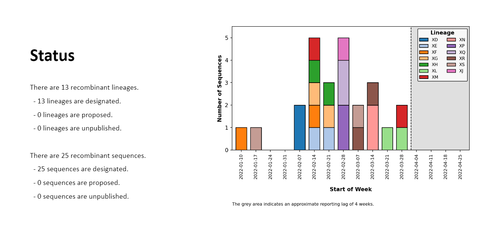

# ncov-recombinant

[](https://github.com/ktmeaton/ncov-recombinant/blob/master/LICENSE)
[](https://github.com/ktmeaton/ncov-recombinant/issues)
[](https://github.com/ktmeaton/ncov-recombinant/actions/workflows/install.yaml)
[](https://github.com/ktmeaton/ncov-recombinant/actions/workflows/test.yaml)
[](https://github.com/ktmeaton/ncov-recombinant/actions/workflows/pipeline.yaml)

SARS-CoV-2 recombinant sequence detection inspired by [nextstrain/ncov](https://github.com/nextstrain/ncov).

1. Align sequences and perform clade/lineage assignments with [Nextclade](https://github.com/nextstrain/nextclade).
1. Identify parental clades and plot recombination breakpoints with [sc2rf](https://github.com/lenaschimmel/sc2rf).
1. Phylogenetically place recombinant sequences with [UShER](https://github.com/yatisht/usher).

## Table of Contents

1. [Output](https://github.com/ktmeaton/ncov-recombinant#output)
1. [Install](https://github.com/ktmeaton/ncov-recombinant#install)
1. [Tutorial](https://github.com/ktmeaton/ncov-recombinant#tutorial
)
1. [Custom Configuration](https://github.com/ktmeaton/ncov-recombinant#custom-configuration)
1. [SLURM](https://github.com/ktmeaton/ncov-recombinant#slurm)
1. [Troubleshooting](https://github.com/ktmeaton/ncov-recombinant#troubleshooting)
1. [Credits](https://github.com/ktmeaton/ncov-recombinant#credits)

## Output

### Tables

Tables collated into a spreadsheet for excel/google sheets:

1. `recombinants`: Per-lineage summary statistics.
1. `linelist`: Per-sequence statistics.
1. `false_positives`: Sequences flagged as potential recombinants by Nextclade, that could not be verified by [sc2rf](https://github.com/lenaschimmel/sc2rf) or [UShER](https://github.com/yatisht/usher).
1. `issues`: Metadata of issues related to recombinant lineages posted in the [pango-designation](https://github.com/cov-lineages/pango-designation/issues) repository.

[](https://docs.google.com/spreadsheets/d/1Voy4zw4VCZSp1K4oSjXPrKVbB1w8K_VnC_a5dxEU4rg/edit#gid=1139120749)

### Slides

Powerpoint/google slides with acommpanying plots for presenting.

[](https://docs.google.com/presentation/d/1dFKHPaaD8wOHt_4Vde_yfSBlHz8m7XrqDDn0pik_hs4/edit#slide=id.p2)

### Breakpoints

Visualization of breakpoints by parent from [sc2rf](https://github.com/lenaschimmel/sc2rf).


### Phylogenetic Context

Placement of samples on the latest global phylogeny using [UShER](https://github.com/yatisht/usher).


## Install

1. Clone the repository, using the `--recursive` flag for submodules:

    ```bash
    git clone --recursive https://github.com/ktmeaton/ncov-recombinant.git
    cd ncov-recombinant
    ```

2. Install dependencies in a conda environment (`ncov-recombinant`):

    ```bash
    mamba env create -f workflow/envs/environment.yaml
    conda activate ncov-recombinant
    ```

## Tutorial

> Tip: Remember to run `conda activate ncov-recombinant` first!

1. Preview the commands that are going to be run.

    ```bash
    snakemake --profile profiles/tutorial --dryrun --printshellcmds
    ```

1. Run the workflow.

    ```bash
    snakemake --profile profiles/tutorial
    ```

1. Inspect the output

    - Slides | `results/tutorial/report.pptx`
    - Tables | `results/tutorial/report.xlsx`
    - Breakpoints<sup>*</sup> | `results/tutorial/sc2rf.recombinants.ansi.txt`
    - Trees<sup>†</sup> | `results/tutorial/subtrees_collapse`

<sup>*</sup> Visualize breakpoints with `less -S` or [Visual Studio ANSI Colors](https://marketplace.visualstudio.com/items?itemName=iliazeus.vscode-ansi).  
<sup>†</sup> Upload Auspice JSON trees to <https://auspice.us/>.

## Custom Configuration

### Data

1. Create new directories for your data, system configuration, and run parameters.

    ```bash
    mkdir -p my_profiles/custom
    mkdir -p data/custom
    ```

1. Copy over your `metadata.tsv` and unaligned `sequences.fasta` to `data/custom`.

    > Note: `metadata.tsv` MUST have at minimum the columns `strain`, `date`, `country`.

### Setting up a template

1. Copy over the default build parameters to get started.

    ```bash
    cp defaults/parameters.yaml my_profiles/custom/builds.yaml
    ```

1. Copy over the minimal system configuration (`laptop`) to get started.

    ```bash
    cp profiles/laptop/config.yaml my_profiles/custom/config.yaml
    ```

### Editing the template

1. Add your build file to the `configfile` element of `my_profiles/custom/config.yaml`:

    ```yaml
    #------------------------------------------------------------------------------#
    # Build Config
    #------------------------------------------------------------------------------#

    configfile:
      - defaults/parameters.yaml
      - my_profiles/custom/builds.yaml
    ```

1. Edit the `jobs` and `default-resources` to match your system.

    > Note: For HPC environments, see the [SLURM](https://github.com/ktmeaton/ncov-recombinant#slurm) section.

    ```yaml
    #------------------------------------------------------------------------------#
    # System config
    #------------------------------------------------------------------------------#

    # Maximum number of jobs to run
    jobs : 2

    # Default resources for a SINGLE JOB
    default-resources:
    - cpus=2
    - mem_mb=8000
    - time_min=120
    ```

1. Create a new **input** entry for your data in `my_profiles/custom/builds.yaml`.

    ```yaml
    inputs:

        # Custom sequences and metadata
        - name: custom
            type:
            - local
            metadata: data/custom/metadata.tsv
            sequences: data/custom/sequences.fasta
    ```

1. Create a new **build** entry in `my_profiles/custom/builds.yaml`, using the latest public data as the UShER base phylogeny.

    ```yaml
    builds:

        - name: custom
            base_input: public-latest
    ```

1. Do a dry run to confirm setup.

    ```bash
    snakemake --profile my_profiles/custom print_config
    snakemake --profile my_profiles/custom --dry-run
    ```

1. Run your custom profile.

    ```bash
    snakemake --profile my_profiles/custom
    ```

## SLURM

The `ncov-recombinant` tutorial workflow can be dispatched using the SLURM job submission system. In `profiles/hpc`, modify the `partition` name in `default-resources` according to your system partition. Then dispatch the workflow using the following command, where `MyPartition` is replaced with your local value:

```bash
bash scripts/slurm.sh --profile profiles/hpc --partition MyPartition
```

## Troubleshooting

- Unlock the workflow after a failed run:

    ```bash
    snakemake --profile profiles/tutorial --unlock
    ```

- Logs for each rule will be stored at: `logs/<rule>/<build>_<date>.txt`
- If using slurm (`profiles/hpc`) the master log will be at: `logs/ncov-recombinant/ncov-recombinant_<date>_<jobid>.log`

## Credits

- nextstrain/ncov: https://github.com/nextstrain/ncov
- nextstrain/nextclade: https://github.com/nextstrain/nextclade
- lenaschimmel/sc2rf: https://github.com/lenaschimmel/sc2rf
- yatisht/usher: https://github.com/yatisht/usher
