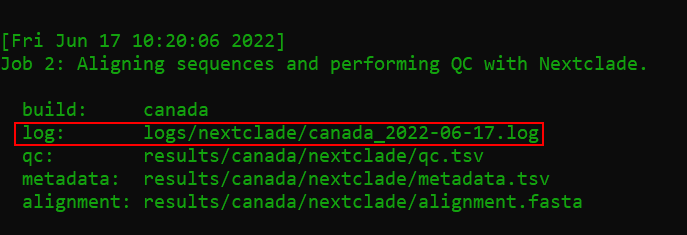

## FAQ

1. What do I do if the workflow won't run because the directory is "locked"?

    ```bash
    snakemake --profile profiles/tutorial --unlock
    ```

1. How do I troubleshoot workflow errors?

    - Start with investigating the logfile of the rule that failed.

    

    - [Issue submissions](https://github.com/ktmeaton/ncov-recombinant/issues/33) are welcome and greatly appreciated!

1. How do I troubleshoot SLURM errors?

    - If the workflow was dispatched with `scripts/slurm.sh`, the master log will be stored at: `logs/ncov-recombinant/ncov-recombinant_<date>_<jobid>.log`

    > - **Tip**: Display log of most recent workflow: `cat $(ls -t logs/ncov-recombinant/*.log | head -n 1)`

1. Why is the pipeline exiting with `ConnectionError` or `HTTPSError`?

    Network connection issues can occur in the rule `sc2rf_recombinants`, where the [LAPIS API](https://lapis-docs.readthedocs.io/en/latest/) is used to query [covSPECTRUM](https://cov-spectrum.org/explore/World) in order to identify the most likely parental lineages. For troubleshooting and solutions, please see [Issue #202](https://github.com/ktmeaton/ncov-recombinant/issues/202) and [Issue #201](https://github.com/ktmeaton/ncov-recombinant/issues/201).

1. How do I cleanup all the output from a previous run?

    ```bash
    snakemake --profile profiles/tutorial --delete-all-output
    ```

1. Why are some lineages called `X*-like`?

    A cluster of sequences may be flagged as `-like` if one of following criteria apply:

    1. The lineage assignment by [Nextclade](https://github.com/nextstrain/nextclade) conflicts with the published breakpoints for a designated lineage (`resources/breakpoints.tsv`).

        - Ex. An `XE` assigned sample has breakpoint `11538:12879` which conflicts with the published `XE` breakpoint (`ex. 8394:12879`). This will be renamed `XE-like`.

    1. The cluster has 10 or more sequences, which share at least 3 private mutations in common.

        - Ex. A large cluster of sequences (N=50) are assigned `XM`. However, these 50 samples share 5 private mutations `T2470C,C4586T,C9857T,C12085T,C26577G` which do not appear in true `XM` sequences. This will be renamed `XM-like`. Upon further review of the reported matching [pango-designation issues](https://github.com/cov-lineages/pango-designation/issues) (`460,757,781,472,798`), we find this cluster to be a match to `proposed798`.

1. Why are some lineages classified as "positive" recombinants but have no information about their parents or breakpoints?

    There are 5 recombinant lineages that _can_ be identified by `nextclade` but _cannot_ be verified by `sc2rf`. When sequences of these lineages are detected by `nextclade`, they will be automatically passed ("autopass") through `sc2rf` as positives. As a result, these sequences will have `NA` values under columns such as `parents_clade` and `breakpoints`.

    1. `XN` | [Issue #137](https://github.com/ktmeaton/ncov-recombinant/issues/137) | Breakpoints lie at the extreme 5' end of the genome.
    1. `XP` | [Issue #136](https://github.com/ktmeaton/ncov-recombinant/issues/137) | Breakpoints lie at the extreme 3' end of the genome.
    1. `XAR` | [Issue #106](https://github.com/ktmeaton/ncov-recombinant/issues/106) | Breakpoints lie at the extreme 5' end of the genome.
    1. `XAS` | [Issue #86](https://github.com/ktmeaton/ncov-recombinant/issues/86) | The first parent cannot be differentiated between `BA.5` and `BA.4` (without using deletions).
    1. `XAZ` | [Issue #87](https://github.com/ktmeaton/ncov-recombinant/issues/87) | There are no "diagnostic" mutations from the second parent (`BA.2`).

    The setting for auto-passing certain lineages is located in `defaults/parameters.yaml` under the section `sc2rf_recombinants` and `auto_pass`.

1. How are the immune-related statistics calculated (ex. `rbd_level`, `immune_escape`, `ace2_binding`)?

    These are obtained from `nextclade`, the `Nextstrain` team, and Jesse Bloom's group:

    - https://github.com/nextstrain/ncov/blob/master/defaults/rbd_levels.yaml
    - https://jbloomlab.github.io/SARS-CoV-2-RBD_DMS_Omicron/epistatic-shifts/
    - https://jbloomlab.github.io/SARS2_RBD_Ab_escape_maps/escape-calc/
    - https://doi.org/10.1093/ve/veac021
    - https://doi.org/10.1101/2022.09.15.507787
    - https://doi.org/10.1101/2022.09.20.508745

1. How do I change the parameters for a rule?

    - Find the rule you are interested in customizing in `defaults/parameters.yaml`. For example, maybe you want recombinants visualized by `division` rather than `country`.

        ```yaml
        # ---------------------------------------------------------------------------
        # geo : Column to use for a geographic summary (typically region, country, or division)
        - name: linelist
          geo: country
        ```

    - Then copy over the defaults into your custom profile (`my_profiles/custom/builds.yaml`), and adjust the yaml formatting. Note that `- name: linelist` has become `linelist:` which is idented to be flush with the `sequences:` parameter.

        ```yaml
        - name: custom
          metadata: data/custom/metadata.tsv
          sequences: data/custom/sequences.fasta

          linelist:
            geo: division
        ```

1. How do I include more of my custom metadata columns into the linelists?

    - By default, the mandatory columns `strain`, `date`, and `country` will appear from your metadata.
    - Extra columns can be supplied as a parameter to `summary` in your `builds.yaml` file.
    - In the following example, the columns `division`, and `genbank_accession` will be extracted from your input `metadata.tsv` file and included in the final linelists.

    ```yaml
    - name: controls
      metadata: data/controls/metadata.tsv
      sequences: data/controls/sequences.fasta

      summary:
        extra_cols:
          - genbank_accession
          - division
    ```

1. Where can I find the plotting data?

    - A data table is provided for each plot:

        - Plot: `results/tutorial/plots/lineage.png`
        - Table: `results/tutorial/plots/lineage.tsv`
        - The rows are the epiweek, and the columns are the categories (ex. lineages)

1. Why are "positive" sequences missing from the plots and slides?

    - First check and see if they are in `plots_historical` and `report_historical` which summarize all sequences regardless of collection date.
    - The most likely reason is that these sequences fall outside of the reporting period.
    - The default reporting period is set to 16 weeks before the present.
    - To change it for a build, add custom `plot` parameters to your `builds.yaml` file.

    ```yaml
    - name: custom
      metadata: data/custom/metadata.tsv
      sequences: data/custom/sequences.fasta

      plot:
        min_date: "2022-01-10"
        max_date: "2022-04-25" # Optional, can be left blank to use current date
    ```
