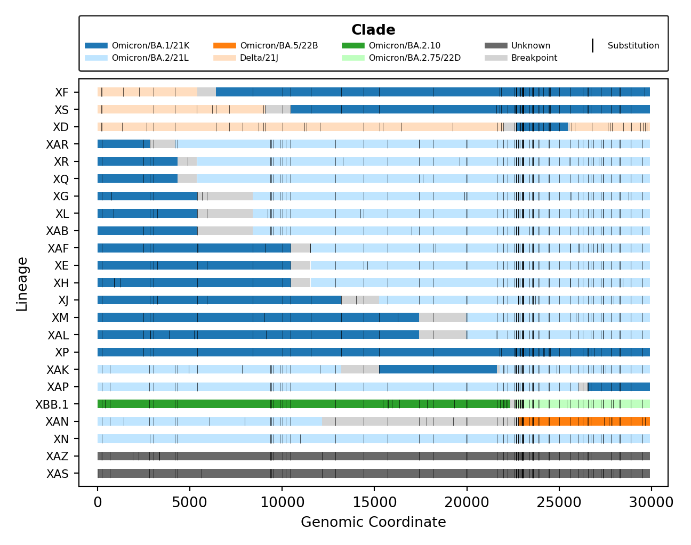
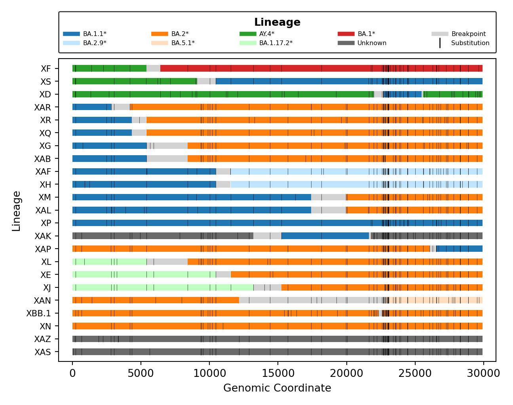

## Output

### Tables

Linelists are collated into a spreadsheet for excel/google sheets:

1. `lineage`: The recombinant lineages observed.
1. `parents`: The parental combinations observed.
1. `linelist`: Results from <u>all</u> input sequences (minimal statistics).
1. `summary`: Results from <u>all</u> input sequences (all possible statistics, for troubleshooting).
1. `positives`: Results from sequences classified as a <u>recombinant</u>, as verified by breakpoint detection with [sc2rf](https://github.com/lenaschimmel/sc2rf).
1. `false_positives`: Results from sequences flagged as recombinants by Nextclade, that were not verified by [sc2rf](https://github.com/lenaschimmel/sc2rf).
1. `negatives`: Results from sequences classifed as a <u>non-recombinant</u> by nextclade.
1. `issues`: Metadata of issues related to recombinant lineages posted in the [pango-designation](https://github.com/cov-lineages/pango-designation/issues) repository.

### Slides

Powerpoint/google slides with plots embedded for presenting.

### Breakpoints

Visualization of breakpoints by parental clade and parental lineage.

|                                         Clade                                          |                                         Lineage                                          |
|:--------------------------------------------------------------------------------------:|:----------------------------------------------------------------------------------------:|
|  |  |

Visualization of parental alleles and mutations from [sc2rf](https://github.com/lenaschimmel/sc2rf).

