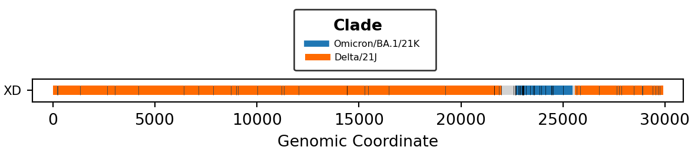

## What is recombination?

Recombination is an evolutionary mechanism where two distinct organisms exchange genetic code to produce a chimeric genome ([VanInsberghe et al. 2021](https://https://doi.org/10.1093/ve/veab059)). This manifests as a novel combination of alleles into blocks or "chunks" across the genome (Figure 1).

Recombination is of particular concern for genomic surveillance, because it can lead to _substantial genetic change_ over a _short period of time_. Public health programs take into account this _rate of genetic change_ to inform policy recommendations, such as vaccine effectiveness and booster frequency ([Malik et al. 2022](https://doi.org/10.1016/j.jiph.2021.12.014)).

SARS-CoV-2 has an estimated _substitution rate_ of 2 substitutions/month or 24 substitutions/year ([Tay et al. 2022](https://doi.org/10.1093/molbev/msac013)). However, the _recombination_ event that led to the Delta-Omicron recombinant `XD` produced a chimeric Delta genome with 25 new substitutions originating from Omicron (Figure 1). This single event produced the same amount of mutations as would have been expected over the course of a year. While more mutations are not necessarily beneficial to the organism, there remains the concerning possibility that recombination can rapidly increase the infectivity and severity of a pathogen.

Figure 1. Genomic composition of the Delta-Omicron recombinant `XD` including breakpoints and substitutions.

### Pipeline Definition

A recombinant SARS-CoV-2 lineage is defined as a group of sequences with a unique combination of:

1. Lineage assignment (ex. `XD`)
1. Parental clades (ex. `Delta`, `Omicron`)
1. Parental lineages (ex. `AY.4`, `BA.1`)
1. Breakpoint intervals (ex. Breakpoint 1: `21988-22672`, Breakpoint 2: `25470-25583`)

### Designated Recombinants

Designated recombinants from [pango-designation](https://github.com/cov-lineages/pango-designation) can be identified in the "positives" pipeline output by a lineage assignment that starts with `X` (ex. `XD`, `XBB`).

### Novel Recombinants

Novel recombinants (i.e. undesignated) can be identified in the "positives" pipeline output by a lineage assignment that _does not_ start with `X*` (ex. `BA.1.1`) _or_ with a lineage assignment that contains `-like` (ex. `XM-like`).
